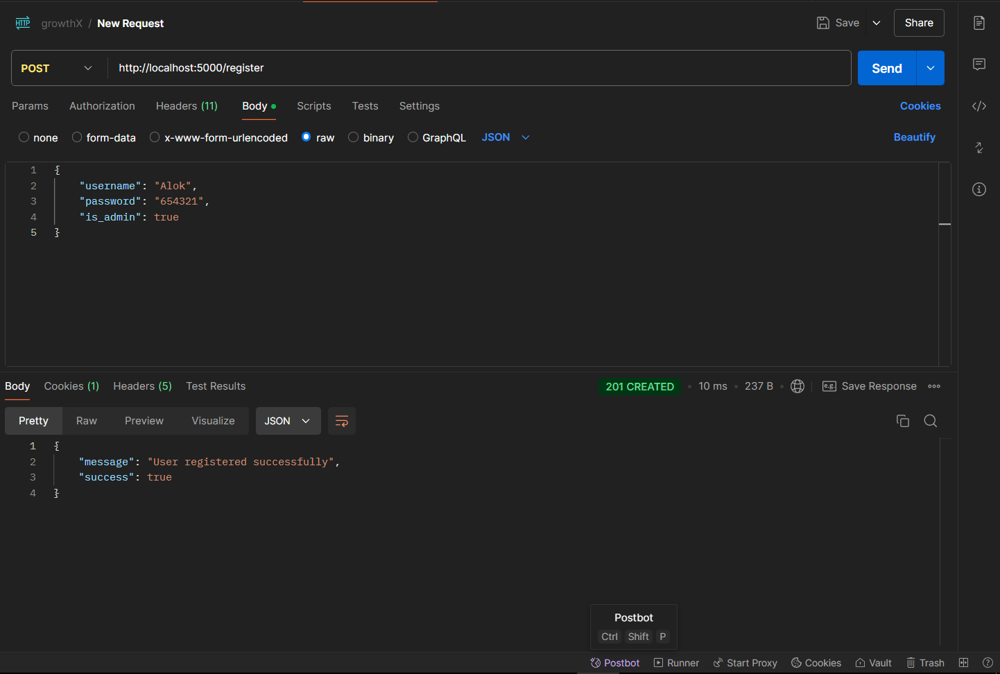
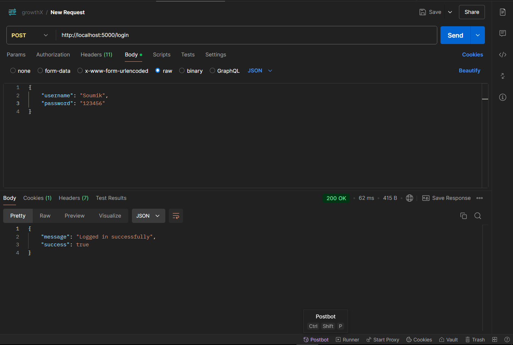
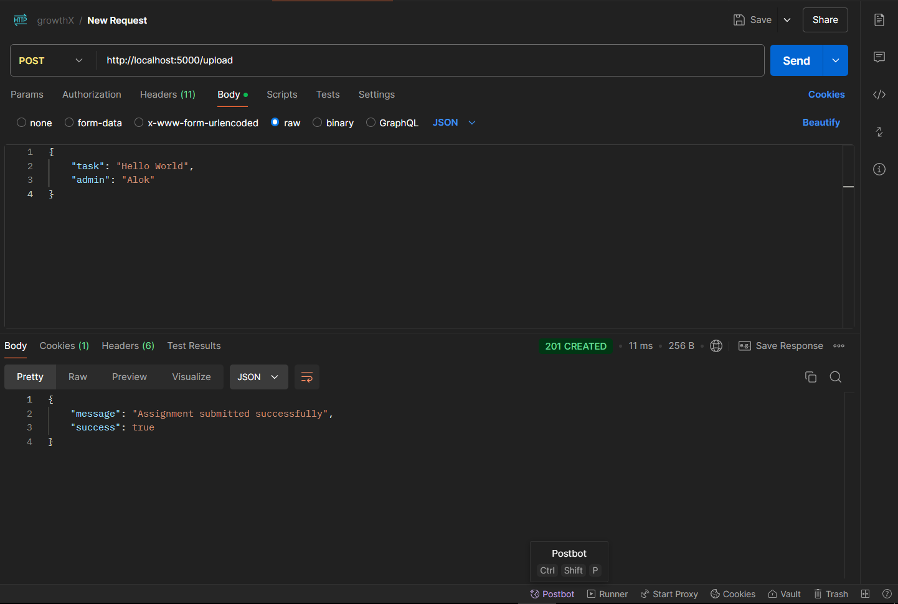
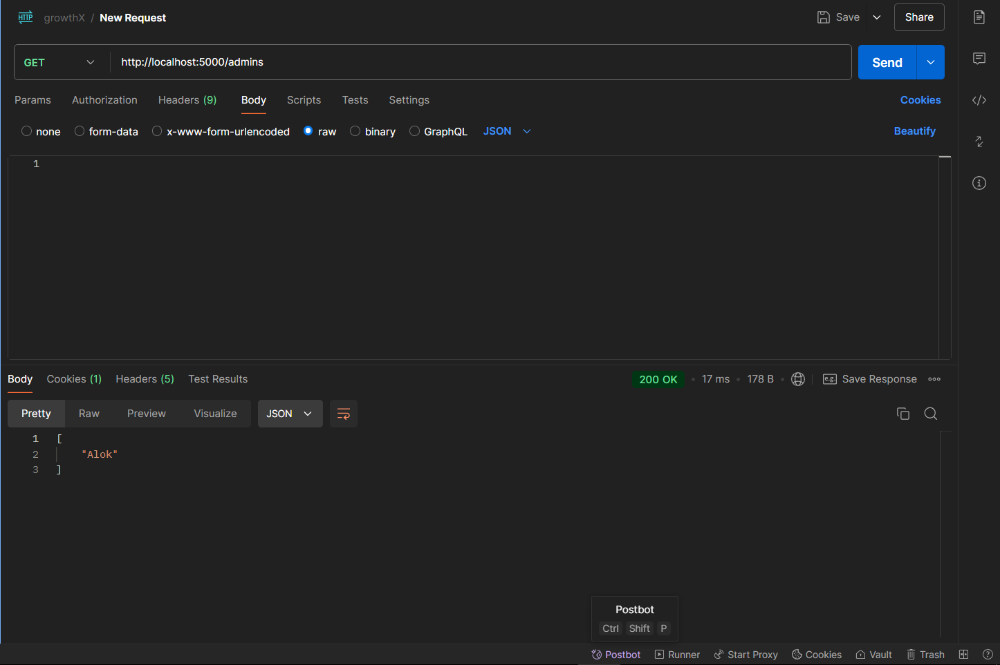
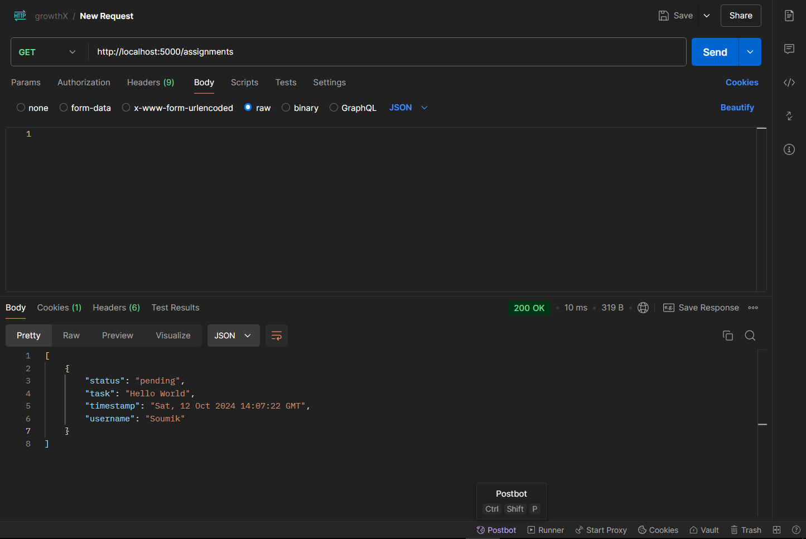
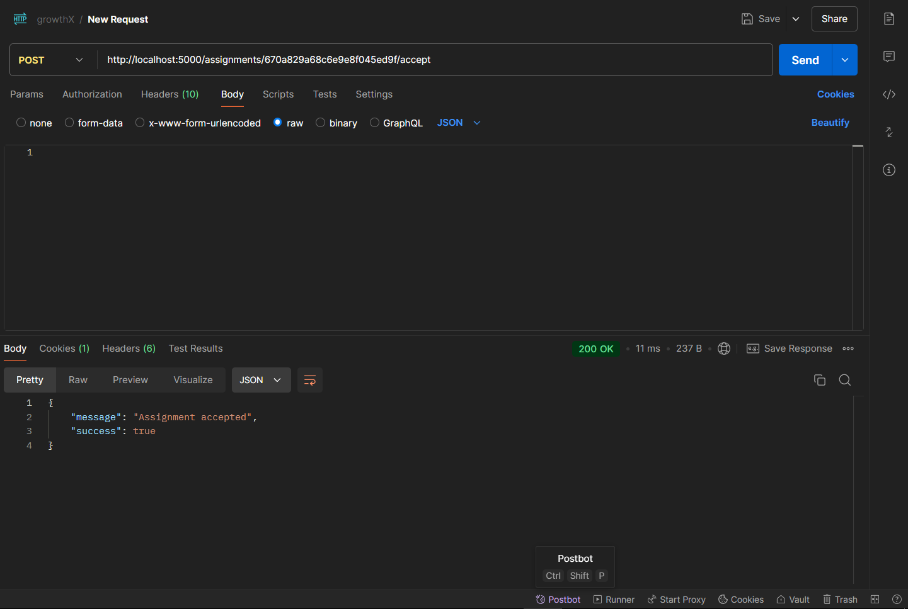
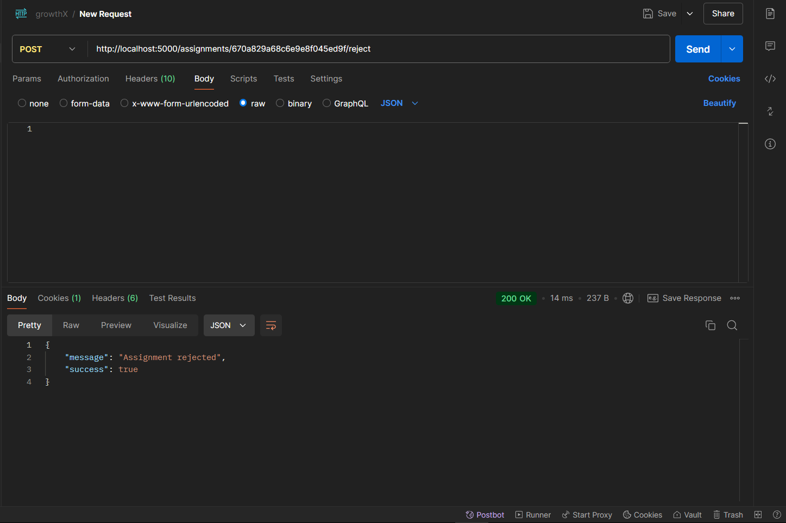

## Getting started
* ##### Prerequisites
  * Python 3.10 or higher
  * Flask

* #### Installation
    To get a local copy up and running follow 
these simple example steps.
  1. Clone the repo

       `git clone https://github.com/singharsh10/GrowthX.git`
  2. Creating virtual environment
      
     `pip install virtualenv`
  
     `python -m venv <myenv>`
  3. Activate virtual environment
  
        * On Windows:
     
          `myenv\Scripts\activate`
        * On macOS/Linux:
     
          `source myenv/bin/activate`

  4. Install requirements
    
     `pip install -r requirements.txt`
  5. Start Flask server
    
     `flask --app app run`

-----------------------
### Usage

register endpoint for users and admins

login endpoint for users and admins

upload endpoint for users

admins endpoint for users

assignments endpoint for admins

accept assignment endpoint for admins

reject assignment endpoint for admins

